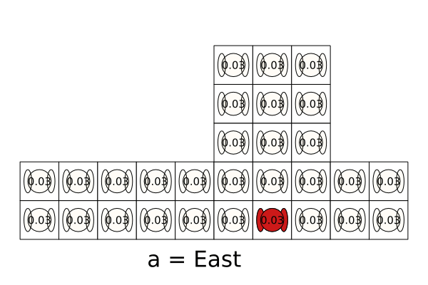
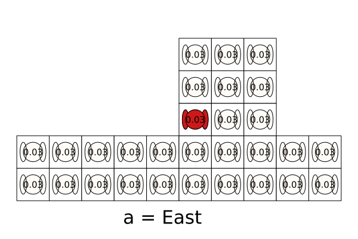
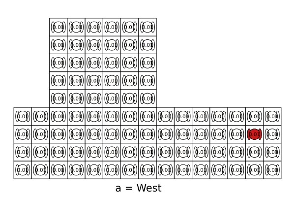

# TagPOMDPProblem.jl

[](https://github.com/dylan-asmar/TagPOMDPProblem.jl/actions/workflows/BuildStatus.yml)
[](https://codecov.io/gh/dylan-asmar/TagPOMDPProblem.jl)

[](https://dylan-asmar.github.io/TagPOMDPProblem.jl/stable)
[](https://dylan-asmar.github.io/TagPOMDPProblem.jl/dev)


The Tag [1] problem with the [POMDPs.jl](https://github.com/JuliaPOMDP/POMDPs.jl) interface. 

[1] Pineau, Joelle et al. “Point-based value iteration: An anytime algorithm for POMDPs.” in *IJCAI* 2003 ([link](https://www.ijcai.org/Proceedings/03/Papers/147.pdf))




## Installation
Use `]` to get to the package manager to add the package. 
```julia
julia> ]
pkg> add TagPOMDPProblem
```


## Problem description
The goal of the agent is to tag the opponent by performing the tag action while in the same square as the opponent. 

- **States**: position of the robot and target and whether the target has been tagged or not

- **Actions**:  The agent can move in the four cardinal directions or perform the tag action. When performing the `tag` action, the robot does not move. The target moves during `tag` if the robot and target are not at the same location.  

- **Transition model**: The movement of the agent is deterministic based on its selected action. The opponent moves stochastically according to a fixed policy away from the agent. The opponent moves away from the agent `move_away_probability` of the time and stays in the same cell otherwise. The implementation of the opponent’s movement policy varies slightly from the original paper allowing more movement away from the agent, thus making the scenario slightly more challenging. This implementation redistributes the probabilities of actions that result in hitting a wall to other actions that result in moving away. See the [transitions.jl](https://github.com/dylan-asmar/TagPOMDPProblem.jl/blob/b0100ddb39b27990a70668187d6f1de8acb50f1e/src/transition.jl#L11) for details. The transition function from the original implementation can be used by passing `orig_transition_fcn = true`.


- **Observation model**: The agent’s position is fully observable but the opponent’s position is unobserved unless both actors are in the same cell. The number of observations is one more than the number of grid squares (e.g. 30 observations for the default problem).

- **Reward model**: A reward of `step_penalty` is imposed for each motion action and the tag action results in a `tag_reward` for a successful tag and `tag_penalty` otherwise.

## Examples

### Default Problem
```julia
using POMDPs
using TagPOMDPProblem
using SARSOP # load a  POMDP Solver
using POMDPGifs # to make gifs

pomdp = TagPOMDP()

solver = SARSOPSolver(; timeout=150)
policy = solve(solver, pomdp)

sim = GifSimulator(filename="test.gif", max_steps=50)
simulate(sim, pomdp, policy)
```




### Larger Grid
```julia
using POMDPs
using TagPOMDPProblem
using SARSOP # load a  POMDP Solver
using POMDPGifs # to make gifs

grid = TagGrid(;bottom_grid=(12, 4), top_grid=(6, 5), top_grid_x_attach_pt=3)
pomdp = TagPOMDP(;tag_grid=grid)
solver = SARSOPSolver(; timeout=600)
policy = solve(solver, pomdp)

sim = GifSimulator(filename="test_larger.gif", max_steps=50)
simulate(sim, pomdp, policy)
```


