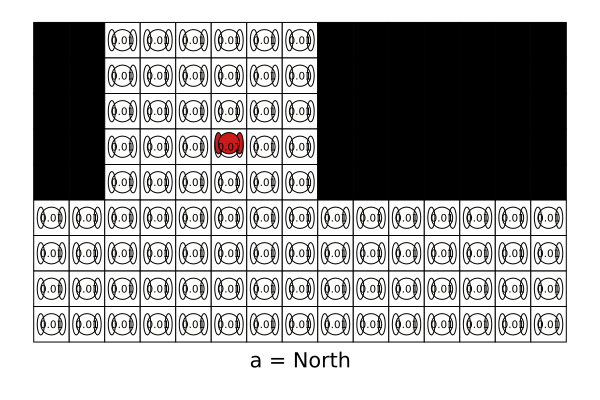

# TagPOMDPProblem.jl Documentation

Tag POMDP problem using [POMDPs.jl](https://github.com/JuliaPOMDP/POMDPs.jl). Original problem was presented in Pineau, Joelle et al. “Point-based value iteration: An anytime algorithm for POMDPs.” IJCAI (2003) ([online here](https://www.ijcai.org/Proceedings/03/Papers/147.pdf)).

The goal of the agent is to tag the opponent by performing the tag action while in the same square as the opponent. The agent can move in the four cardinal directions or perform the tag action. The movement of the agent is deterministic based on its selected action. A reward of `step_penalty` is imposed for each motion action and the tag action results in a `tag_reward` for a successful tag and `tag_penalty` otherwise. The agent’s position is fully observable but the opponent’s position is unobserved unless both actors are in the same cell. The opponent moves stochastically according to a fixed policy away from the agent. The opponent moves away from the agent `move_away_probability` of the time and stays in the same cell otherwise. The implementation of the opponent’s movement policy varies slightly from the original paper allowing more movement away from the agent, thus making the scenario slightly more challenging. This implementation redistributes the probabilities of actions that result in hitting a wall to other actions that result in moving away. The original transition function is available by passing `transition_option=:orig` during creation of the problem.

## Manual Outline

```@contents
```

## Installation
Use `]` to get to the package manager to add the package. 
```julia
julia> ]
pkg> add TagPOMDPProblem
```

## Examples

### Default Problem
```julia
using POMDPs
using TagPOMDPProblem
using SARSOP # load a  POMDP Solver
using POMDPGifs # to make gifs

pomdp = TagPOMDP()
solver = SARSOPSolver(; timeout=150)
policy = solve(solver, pomdp)
sim = GifSimulator(;
    filename="default.gif",
    max_steps=50
)
simulate(sim, pomdp, policy)
```


### Larger Map
```julia
using POMDPs
using TagPOMDPProblem
using SARSOP 
using POMDPGifs

map_str = """
xxooooooxxxxxxx
xxooooooxxxxxxx
xxooooooxxxxxxx
xxooooooxxxxxxx
xxooooooxxxxxxx
ooooooooooooooo
ooooooooooooooo
ooooooooooooooo
ooooooooooooooo
"""
pomdp = TagPOMDP(;map_str=map_str)
solver = SARSOPSolver(; timeout=600)
policy = solve(solver, pomdp)

sim = GifSimulator(;
    filename="larger.gif",
    max_steps=50
)
simulate(sim, pomdp, policy)
```



### Map with Obstacles
```julia
using POMDPs
using TagPOMDPProblem
using SARSOP 
using POMDPGifs

map_str = """
xxxxxxxxxx
xoooooooox
xoxoxxxxox
xoxoxxxxox
xoxooooxox
xoxoxxoxox
xoxoxxoxox
xoxoxxoxox
xoooooooox
xxxxxxxxxx
"""
pomdp = TagPOMDP(;map_str=map_str)
solver = SARSOPSolver(; timeout=600)
policy = solve(solver, pomdp)

sim = GifSimulator(;
    filename="boundary.gif",
    max_steps=50,
    rng=Random.MersenneTwister(1)
)
simulate(sim, pomdp, policy)
```


# Exported Functions
```@docs
TagPOMDP()
POMDPTools.render(::TagPOMDP, ::Any)
TagPOMDP
TagState
```

# Internal Functions
```@docs
TagPOMDPProblem.list_actions(::TagPOMDP)
TagPOMDPProblem.create_metagraph_from_map(::String)
TagPOMDPProblem.map_str_from_metagraph(::TagPOMDP)
TagPOMDPProblem.state_from_index(::TagPOMDP, ::Int)
TagPOMDPProblem.modified_transition(::TagPOMDP, ::TagState, ::Int)
TagPOMDPProblem.orig_transition(::TagPOMDP, ::TagState, ::Int)
TagPOMDPProblem.move_direction(::TagPOMDP, ::Int, ::Int)
```